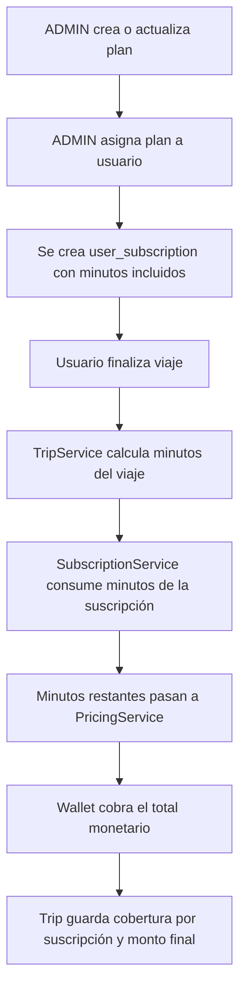

# Documento del Módulo de Suscripciones

## 1. Objetivo

Este documento describe todo lo relacionado con el módulo de suscripciones de `Cyclix API` según la implementación actual del backend.

El módulo permite:

- Definir planes de suscripción administrables.
- Asignar un plan a un usuario para un rango de fechas.
- Llevar control de minutos incluidos, consumidos y restantes.
- Aplicar esos minutos al finalizar un viaje antes de calcular la tarifa monetaria.

## 2. Alcance actual

En el estado actual del proyecto, las suscripciones:

- Se administran únicamente desde endpoints de `ADMIN`.
- Cubren minutos de viaje, no montos de dinero.
- Se aplican al finalizar un viaje, no al iniciarlo.
- Reducen los minutos facturables antes de que entre el módulo de `pricing`.
- Guardan si la suscripción fue usada en el viaje y cuántos minutos cubrió.

No encontré en el código revisado:

- Endpoints para que el usuario final compre su propia suscripción.
- Lógica automática de renovación aunque exista el campo `autoRenew`.
- Lógica de cancelación de suscripción aunque exista el estado `CANCELLED`.
- Una tarea programada que expire suscripciones fuera del flujo de consumo.

## 3. Archivos principales

### Backend

- [AdminSubscriptionController.kt](/Users/diego/IdeaProjects/cyclix-api/src/main/kotlin/com/cyclix/cyclix_api/subscription/controller/AdminSubscriptionController.kt:18)
- [SubscriptionService.kt](/Users/diego/IdeaProjects/cyclix-api/src/main/kotlin/com/cyclix/cyclix_api/subscription/service/SubscriptionService.kt:21)
- [SubscriptionDtos.kt](/Users/diego/IdeaProjects/cyclix-api/src/main/kotlin/com/cyclix/cyclix_api/subscription/dto/SubscriptionDtos.kt:11)
- [SubscriptionPlan.kt](/Users/diego/IdeaProjects/cyclix-api/src/main/kotlin/com/cyclix/cyclix_api/subscription/entity/SubscriptionPlan.kt:12)
- [UserSubscription.kt](/Users/diego/IdeaProjects/cyclix-api/src/main/kotlin/com/cyclix/cyclix_api/subscription/entity/UserSubscription.kt:17)
- [SubscriptionPlanRepository.kt](/Users/diego/IdeaProjects/cyclix-api/src/main/kotlin/com/cyclix/cyclix_api/subscription/repository/SubscriptionPlanRepository.kt:1)
- [UserSubscriptionRepository.kt](/Users/diego/IdeaProjects/cyclix-api/src/main/kotlin/com/cyclix/cyclix_api/subscription/repository/UserSubscriptionRepository.kt:8)

### Integración con viajes

- [TripService.kt](/Users/diego/IdeaProjects/cyclix-api/src/main/kotlin/com/cyclix/cyclix_api/trip/service/TripService.kt:140)
- [TripResponse.kt](/Users/diego/IdeaProjects/cyclix-api/src/main/kotlin/com/cyclix/cyclix_api/trip/dto/TripResponse.kt:7)

### Base de datos

- [V7__pricing_subscription_wallet_audit.sql](/Users/diego/IdeaProjects/cyclix-api/src/main/resources/db/migration/V7__pricing_subscription_wallet_audit.sql:37)

### Pruebas

- [SubscriptionServiceTest.kt](/Users/diego/IdeaProjects/cyclix-api/src/test/kotlin/com/cyclix/cyclix_api/subscription/service/SubscriptionServiceTest.kt:21)

## 4. Modelo de datos

### 4.1 Tabla `subscription_plans`

Se crea en [V7__pricing_subscription_wallet_audit.sql](/Users/diego/IdeaProjects/cyclix-api/src/main/resources/db/migration/V7__pricing_subscription_wallet_audit.sql:37) con estos campos:

- `id`
- `name`
- `monthly_price`
- `included_hours`
- `active`
- `created_at`
- `updated_at`

Restricciones principales:

- Nombre único: `uq_subscription_plan_name`
- Precio mensual `>= 0`
- Horas incluidas `> 0`

Representación en código:

- [SubscriptionPlan.kt](/Users/diego/IdeaProjects/cyclix-api/src/main/kotlin/com/cyclix/cyclix_api/subscription/entity/SubscriptionPlan.kt:14)

### 4.2 Tabla `user_subscriptions`

Se crea en [V7__pricing_subscription_wallet_audit.sql](/Users/diego/IdeaProjects/cyclix-api/src/main/resources/db/migration/V7__pricing_subscription_wallet_audit.sql:51) con estos campos:

- `id`
- `user_id`
- `plan_id`
- `status`
- `starts_at`
- `expires_at`
- `included_minutes`
- `consumed_minutes`
- `remaining_minutes`
- `auto_renew`
- `created_at`
- `updated_at`

Restricciones principales:

- FK a `user`
- FK a `subscription_plans`
- `status` restringido a `ACTIVE | EXPIRED | CANCELLED`
- `included_minutes > 0`
- `consumed_minutes >= 0`
- `remaining_minutes >= 0`

Representación en código:

- [UserSubscription.kt](/Users/diego/IdeaProjects/cyclix-api/src/main/kotlin/com/cyclix/cyclix_api/subscription/entity/UserSubscription.kt:19)

Estados soportados por enum:

- `ACTIVE`
- `EXPIRED`
- `CANCELLED`

## 5. Contratos HTTP

Todos los endpoints actuales están bajo:

- `/api/v1/admin/subscriptions`

Y están protegidos con:

- `@PreAuthorize("hasRole('ADMIN')")`

Referencia:

- [AdminSubscriptionController.kt](/Users/diego/IdeaProjects/cyclix-api/src/main/kotlin/com/cyclix/cyclix_api/subscription/controller/AdminSubscriptionController.kt:18)

### 5.1 Listar planes

- `GET /api/v1/admin/subscriptions/plans`

Retorna una lista de `SubscriptionPlanResponse`.

### 5.2 Crear plan

- `POST /api/v1/admin/subscriptions/plans`

Body:

```json
{
  "name": "Plan Plus 50h",
  "monthlyPrice": 200.00,
  "includedHours": 50,
  "active": true
}
```

Validaciones:

- `name` obligatorio
- `monthlyPrice >= 0`
- `includedHours > 0`
- `active` obligatorio

Referencia:

- [SubscriptionDtos.kt](/Users/diego/IdeaProjects/cyclix-api/src/main/kotlin/com/cyclix/cyclix_api/subscription/dto/SubscriptionDtos.kt:11)

### 5.3 Actualizar plan

- `PUT /api/v1/admin/subscriptions/plans/{id}`

Usa el mismo contrato de `SubscriptionPlanRequest`.

Si el plan no existe:

- responde `404`

Referencia:

- [SubscriptionService.kt](/Users/diego/IdeaProjects/cyclix-api/src/main/kotlin/com/cyclix/cyclix_api/subscription/service/SubscriptionService.kt:47)

### 5.4 Asignar plan a usuario

- `POST /api/v1/admin/subscriptions/assign`

Body:

```json
{
  "userId": 15,
  "planId": 2,
  "startsAt": "2026-05-01T00:00:00",
  "expiresAt": "2026-05-31T23:59:59",
  "autoRenew": false
}
```

Validaciones:

- `userId` obligatorio y positivo
- `planId` obligatorio y positivo
- `startsAt` obligatorio
- `expiresAt` obligatorio
- `expiresAt > startsAt`
- `autoRenew` obligatorio

Si no existe el usuario o el plan:

- responde `404`

Referencia:

- [SubscriptionDtos.kt](/Users/diego/IdeaProjects/cyclix-api/src/main/kotlin/com/cyclix/cyclix_api/subscription/dto/SubscriptionDtos.kt:32)
- [SubscriptionService.kt](/Users/diego/IdeaProjects/cyclix-api/src/main/kotlin/com/cyclix/cyclix_api/subscription/service/SubscriptionService.kt:60)

## 6. Lógica de negocio

### 6.1 Crear y actualizar planes

La lógica está en [SubscriptionService.kt](/Users/diego/IdeaProjects/cyclix-api/src/main/kotlin/com/cyclix/cyclix_api/subscription/service/SubscriptionService.kt:32).

Comportamiento actual:

- El nombre se guarda con `trim()`.
- `monthlyPrice` se redondea a 2 decimales con `RoundingMode.HALF_UP`.
- `includedHours` se guarda tal como llega.
- `active` solo se almacena; no existe una regla adicional que impida asignar un plan inactivo.

Observación importante:

- En la asignación de planes no se valida `plan.active`, así que hoy el backend podría asignar un plan inactivo si existe en la base.

### 6.2 Asignación de suscripciones a usuarios

La asignación transforma horas a minutos:

- `includedMinutes = plan.includedHours * 60`

Luego crea el registro de `user_subscriptions` con:

- `status = ACTIVE`
- `consumedMinutes = 0`
- `remainingMinutes = includedMinutes`
- `autoRenew = request.autoRenew`

Referencia:

- [SubscriptionService.kt](/Users/diego/IdeaProjects/cyclix-api/src/main/kotlin/com/cyclix/cyclix_api/subscription/service/SubscriptionService.kt:75)

Observaciones de comportamiento:

- No hay validación para evitar múltiples suscripciones activas superpuestas para un mismo usuario.
- No se cierra ni cancela una suscripción previa al asignar otra.

### 6.3 Consumo de minutos

La lógica central está en [SubscriptionService.kt](/Users/diego/IdeaProjects/cyclix-api/src/main/kotlin/com/cyclix/cyclix_api/subscription/service/SubscriptionService.kt:99).

Reglas:

- Si `tripMinutes <= 0`, retorna `0` cubiertos y `0` facturables.
- Busca una suscripción `ACTIVE` del usuario cuyo rango cubra el momento del viaje.
- Si no encuentra una, todos los minutos del viaje quedan facturables.
- Si encuentra una pero está vencida o sin minutos restantes, la marca `EXPIRED`.
- Consume `min(remainingMinutes, tripMinutes)`.
- Resta lo consumido de `remainingMinutes`.
- Suma lo consumido a `consumedMinutes`.
- Si ya no quedan minutos, cambia el estado a `EXPIRED`.

El resultado del método es:

- `subscription`: suscripción usada o `null`
- `minutesCovered`: minutos cubiertos por la suscripción
- `billableMinutes`: minutos que sí pasan a pricing

### 6.4 Selección de la suscripción activa

La consulta actual del repositorio es:

- [UserSubscriptionRepository.kt](/Users/diego/IdeaProjects/cyclix-api/src/main/kotlin/com/cyclix/cyclix_api/subscription/repository/UserSubscriptionRepository.kt:9)

Comportamiento:

- filtra por `userId`
- filtra por `status = ACTIVE`
- exige `startsAt <= at`
- exige `expiresAt >= at`
- ordena por `expiresAt desc`
- toma solo la primera coincidencia

Esto significa que, si un usuario tiene varias suscripciones activas superpuestas, se usará la que expire más tarde.

## 7. Integración con viajes, pricing y wallet

El punto de integración está en [TripService.kt](/Users/diego/IdeaProjects/cyclix-api/src/main/kotlin/com/cyclix/cyclix_api/trip/service/TripService.kt:140).

Flujo al finalizar un viaje:

1. Se calcula la duración real del viaje en segundos.
2. Se convierte a minutos redondeando hacia arriba.
3. Se llama `subscriptionService.consumeMinutes(...)`.
4. Los minutos no cubiertos pasan a `pricingService.calculate(...)`.
5. El monto calculado se cobra al wallet.
6. Se guarda en el viaje cuánto cubrió la suscripción y cuánto terminó facturándose.

Código clave:

- `tripDurationMinutes` se calcula con `ceil`.
- `subscriptionResult = subscriptionService.consumeMinutes(...)`
- `pricingCalculation = pricingService.calculate(endedAt, subscriptionResult.billableMinutes)`

Referencia:

- [TripService.kt](/Users/diego/IdeaProjects/cyclix-api/src/main/kotlin/com/cyclix/cyclix_api/trip/service/TripService.kt:140)

## 8. Datos que quedan guardados en `trips`

La migración [V7__pricing_subscription_wallet_audit.sql](/Users/diego/IdeaProjects/cyclix-api/src/main/resources/db/migration/V7__pricing_subscription_wallet_audit.sql:120) añadió estos campos a `trips`:

- `subscription_applied`
- `subscription_minutes_covered`
- `billable_minutes`

Además, en la respuesta del viaje aparecen:

- `subscriptionApplied`
- `subscriptionMinutesCovered`
- `billableMinutes`

Referencia:

- [TripResponse.kt](/Users/diego/IdeaProjects/cyclix-api/src/main/kotlin/com/cyclix/cyclix_api/trip/dto/TripResponse.kt:20)

Esto permite que frontend o reporting muestren:

- duración total del viaje
- cuánto cubrió la suscripción
- cuánto se cobró realmente

## 9. Auditoría

El módulo genera auditoría en estos eventos:

- `SUBSCRIPTION_PLAN_CREATED`
- `SUBSCRIPTION_PLAN_UPDATED`
- `SUBSCRIPTION_ASSIGNED`
- `SUBSCRIPTION_MINUTES_CONSUMED`

Referencia:

- [SubscriptionService.kt](/Users/diego/IdeaProjects/cyclix-api/src/main/kotlin/com/cyclix/cyclix_api/subscription/service/SubscriptionService.kt:42)

## 10. Datos sembrados por defecto

La migración inicial crea planes demo:

- `Plan Básico 20h`
- `Plan Plus 50h`
- `Plan Pro 100h`

Referencia:

- [V7__pricing_subscription_wallet_audit.sql](/Users/diego/IdeaProjects/cyclix-api/src/main/resources/db/migration/V7__pricing_subscription_wallet_audit.sql:148)

## 11. Pruebas existentes

Las pruebas unitarias del servicio están en:

- [SubscriptionServiceTest.kt](/Users/diego/IdeaProjects/cyclix-api/src/test/kotlin/com/cyclix/cyclix_api/subscription/service/SubscriptionServiceTest.kt:21)

Casos cubiertos:

- Cuando la suscripción alcanza para cubrir todo el viaje.
- Cuando la suscripción no alcanza y deja minutos facturables.
- Cuando se consumen todos los minutos y la suscripción pasa a `EXPIRED`.

Ejemplos validados por test:

- Si quedan `200` minutos y el viaje dura `90`, cubre `90` y quedan `110`.
- Si quedan `30` minutos y el viaje dura `95`, cubre `30`, deja `65` facturables y expira.

## 12. Consideraciones y limitaciones actuales

Puntos importantes del diseño actual:

- Las suscripciones trabajan en minutos, aunque los planes se configuran en horas.
- La aplicación de la suscripción ocurre al finalizar el viaje.
- El campo `autoRenew` se persiste, pero no hay lógica visible de renovación automática.
- El estado `CANCELLED` existe en el enum y la BD, pero no encontré un flujo que lo use.
- No encontré endpoints para listar las suscripciones de un usuario o consultar la suscripción activa.
- No se evita superposición de suscripciones activas.
- La asignación no valida que el plan esté `active = true`.

## 13. Flujo resumido



## 14. Ejemplos operativos

### Caso A: viaje cubierto completamente por la suscripción

- Plan: `50h`
- Minutos restantes antes del viaje: `180`
- Duración del viaje: `90`

Resultado:

- `minutesCovered = 90`
- `billableMinutes = 0`
- `subscriptionApplied = true`
- `subscriptionMinutesCovered = 90`
- `totalAmount = 0.00`

### Caso B: viaje cubierto parcialmente

- Minutos restantes antes del viaje: `30`
- Duración del viaje: `95`

Resultado:

- `minutesCovered = 30`
- `billableMinutes = 65`
- la suscripción pasa a `EXPIRED`
- esos `65` minutos van al módulo de pricing

## 15. Recomendaciones para evolución

Si este módulo va a crecer, las mejoras más naturales serían:

- agregar consulta de suscripción activa por usuario
- impedir o controlar superposición de suscripciones
- validar que solo se asignen planes activos
- implementar cancelación de suscripción
- implementar renovación automática real usando `autoRenew`
- agregar expiración programada fuera del flujo de viajes
- crear pruebas de integración end-to-end entre `subscription`, `trip`, `pricing` y `wallet`
